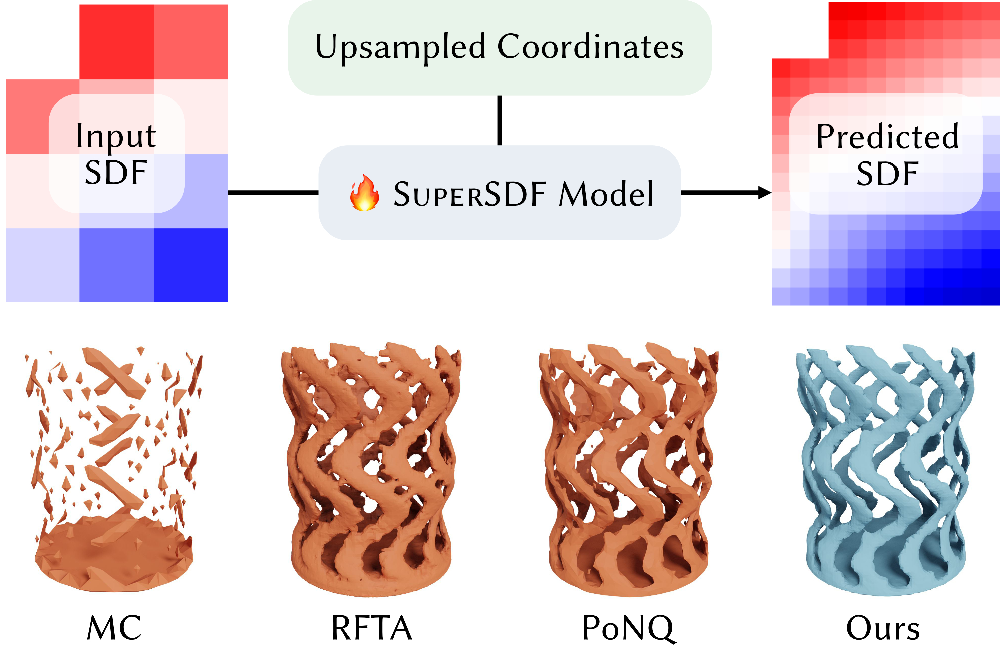

# SuperSDF: Learning-based Sparse Signed Distance Field Super-Resolution

SuperSDF is a learning-based method for signed distance field super-resolution that reconstructs high-fidelity meshes from coarse inputs, without mesh supervision or auxiliary surface representations. Using a sparse voxel network near the surface, our approach learns how to directly refine the input SDF, outperforming prior methods in quality, efficiency, and scalability.

<p align="center">
  
</p>

## Downloading data

```shell
mkdir data 
cd data
pip install gdown
gdown 1YyYOgn8uxGH6Nz_gGk8OR7IuLKUF89Ze
```

untar 
```shell
pip install py7zr
py7zr x groundtruth.7z 
```

Remove unecessary file
```shell
rm groundtruth.7z 
```

## Getting Started

1. Start by cloning the repository and *fVDB* submodule:

```shell
git clone --recursive https://github.com/Sagar160/SSU.git
```

2. Create the `ssu` conda environment (tested with CUDA 12.1):
````shell
conda env create -f dev_env.yml
conda activate ssu
````


3. Our code requires building *fVDB*, which can take a while (please refer to the original [README](openvdb/fvdb/README.md) for more details). Run: 
```shell
cd openvdb/fvdb
export MAX_JOBS=$(free -g | awk "/^Mem:/{jobs=int($4/2.5); if(jobs<1) jobs=1; print jobs}")
pip install .
cd ../..
```

## Implementation

Please consider this config file: config_test.yaml
```shell
conda activate ssu
cd ssu/run
python main.py --config config_test.yaml
```
Now you can play with the parameters and run different experiements.

if you want to change model, can be done in main.py file.

## Benchmarking

Our benchmarking methodology is directly inspired by [PoNQ](https://github.com/nissmar/PoNQ/tree/main/src/eval). We employ a nearly identical evaluation framework to ensure consistency and comparability in our results.

```shell
cd ssu/benchmarking
python get_prediction.py --config config_eval.yaml
```

## 🚀 Demo

For a hands-on experience, please refer to the **demo notebook** located at `demo/demo.ipynb`. You can load the **trained model** directly to test results and run inference on your own data.

# Configuration File Overview

### 📊 Logging
*   **`logging`**: Enable or disable logging to **Weights & Biases (WandB)**.

### 📁 Data
*   **`dataset_grids`**: Specific grid data to be loaded.
*   **`mask_threshold`**: The threshold value used for **masking**.
*   **`sdf_scaling_value`**: The value applied for **SDF scaling**.
*   **`unique_random_direction`**: Boolean; determines if a **random direction** is assigned to each voxel.

### ⚙️ Training
*   **`use_pre_train_model`**: Toggle to use a **pretrained model**.
*   **`pre_train_model_name`**: The name or path of the **pretrained model** to load.

### 🧪 Evaluation
*   **`only_eval`**: Set to true if you only want to **run evaluation** (e.g., if training completed but evaluation failed).
*   **`run_eval`**: Determines whether to **run evaluation** at the end of a session.
*   **`normalize`**: The specific **normalization method** used for evaluation.

## Model Architecture

We experimented with a U-Net-inspired architecture for hierarchical feature extraction and multi-scale reconstruction.

# 📑 Acknowledgments

We would like to express our gratitude to the following project teams and organizations for their invaluable support and contributions to this work:

*   **[TITANE Project-Team](https://inria.fr)**: For their expertise and guidance in geometric modeling and 3D vision.
*   **[Inria Centre at Université Côte d'Azur](https://inria.fr)**: For providing the research environment and resources necessary for this project.


  